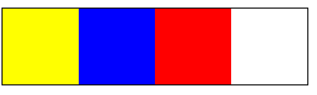

# La Bandera
 Sprint4: RESPONSIVE AND CSS FRAMEWORKS -LECCIÓN 28 - FLOATING: LEFT, RIGHT / CLEARFIX
## GitHub
Click [aquí]( https://mgmp2.github.io/laBandera/)

## Ramas

  ### firstPart
  Consiste en que sólo se cree 3 divs en un contenedor
  
  
  ### secondPart
  Siguiendo por la primera parte se le agrego la propiedad float a los divs con el valor **left**
   
   
  ### thirdPart
  Finalmente se agregó la propiedad float a los divs con el valor **right**
   
   
 ### master
 En esta rama se integra las tres ramas mencionada anteriormente
